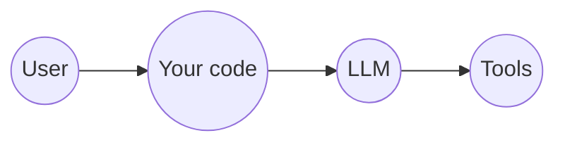
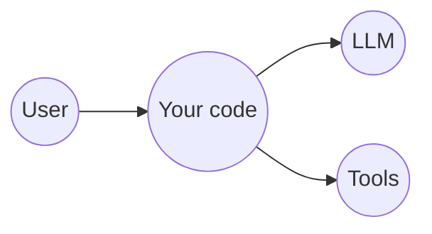

# Curriculum Review and Alignment

**Scope:** `Outline.md` audited against the signed datasheet (`AI Agents-Outline.pdf`), the current delivery rules, and the reference material in `other_content/`.

**Verdict.** The architecture of `Outline.md` is sound and its spine should be kept. The revision it needs is not a rewrite but four changes, in descending order of consequence:

1. **Frameworks become a ladder, not a comparison slide** (section 5.1). The same agent, same tools, re-implemented at each tier from no-framework to managed runtime. This becomes the organising idea of the course's second half and gives the room a defensible adoption answer rather than a feature table.
2. **Three modules are missing and get added** (section 10): context engineering, async and concurrency, and the split of governance into security and evals. Context engineering is the largest genuine hole — the current spine steps straight over the failure mode that ends most enterprise agent pilots.
3. **The clock comes out** (section 2.1). `Outline.md` is a minute-resolution two-day grid; the delivery rules forbid one. Sequence, weight, and elasticity replace it.
4. **The provider strategy gains a seam** (section 2.2), and the retrieval stack is resolved to zero student signups (section 3.1).

Read sections 5.1, 9, and 10 first. They are the substance. Everything else is the audit that justifies them.

---

## 1. Contractual coverage audit

The datasheet commits to specific deliverables. This is where each one currently lands.

| Datasheet commitment | Where it lands in `Outline.md` | Status |
|---|---|---|
| LangChain / LangGraph | M6 orchestration code-along (port the hand-rolled loop to LangGraph) | Covered, hands-on |
| LangSmith | M13 governance, tracing demo on the free developer tier | Covered, demo |
| Llama Index | M10 Lab 2, one of three retrieval paths, executed locally | Covered, hands-on |
| Pinecone | M10 Lab 2, "code shown and explained, not executed" | **Gap — see 3.3** |
| Agent for database search and chat for customer support | M5 Lab 1, read-only MCP server over a customer/orders/inventory SQLite DB | Covered, lab |
| Agent for data analysis and chart creation for BI | M7, agent writes matplotlib, students run it | Covered, hands-on |
| Executing generated code safely | M7, sandboxing spectrum plus container boundary on/off | Covered, hands-on |
| Process re-engineering with AI agents | M15 workshop, autonomy-tier mapping against a real process | Covered, workshop |
| Common agent designs (sub-agents, agent networks, hybrid) | M11 delegation patterns plus M12 supervisor code-along | Covered |
| Business use cases across industries | M1 plus the M15 workshop framing | Covered, light |

The datasheet's exact wording for the tools module is *"Practical exercises: Setting up and using Pinecone, LangChain, LangSmith, and Llama Index."* Three of the four are set up and used by the student. Pinecone currently is not, and that is the one line an attendee holding the signed PDF can check.

---

## 2. Structural assessment

### What is working and should not be touched

**The build-up spine.** Each module existing because the previous one left a problem unsolved is the strongest organising idea in the document. It survives vendor renaming, it gives every transition a reason, and it makes the cross-cloud material land as "who sells this layer" rather than as a logo tour.

**The six-layer reference model.** This is the one durable handout. It answers "what applies to me" for an attendee on any cloud, and the MCP/A2A-as-open-standards row is the argument for the whole course design.

**The anchor artifact.** Building a from-scratch ReAct loop early and referring back to it at every layer ("this is what a framework's state object replaces") is what makes the later modules deltas rather than new material.

**The reference-only treatment of AWS and GCP.** One sentence per concept module, no time budget, no demo. The stated reason — that a wrong answer about Bedrock in front of an enterprise architect costs more than the mention is worth — is correct, and the mapping table absorbs the curiosity without spending class time.

### What conflicts with the current delivery rules

**2.1 The clock.** `Outline.md` is built on a minute-resolution two-day grid: `0:00-0:20`, `1:10-1:25 Break`, per-module durations in every heading, and a rule that *"every stage carries a time budget in its header."* The delivery rules now say the opposite — no fixed hourly timelines, no strict multi-day schedules, modules sequenced so they can be reordered, condensed, or expanded on real-time pacing. This is a direct contradiction and it propagates into every notebook if it is not resolved first, because the four-stage rhythm currently inherits the time budget rule.

*Recommended replacement:* keep the ordering, drop the arithmetic. Each module gets a **relative weight** (S / M / L), a **mode** (slides, code-along, lab, demo, workshop), and an explicit **condense rule** and **expand rule** telling the instructor what to cut first and what to open up if the room is ahead. The two-day container becomes a note about which modules make a natural stopping point, not a timetable.

**2.2 The provider strategy.** `Outline.md` states that students touch exactly one model provider, and demotes Gemini to a three-minute instructor aside on the instructor's own key. The delivery rules call for shared OpenAI as primary with **free-tier Gemini as a secondary/backup where feasible**. These are not the same course.

The reasoning in `Outline.md` for narrowing to one provider is good and worth preserving: every additional credential is a failure mode in a room of twenty. But "backup" and "second required credential" are different asks. The resolution that satisfies both: the client factory exposes a provider seam, every notebook reads its client from that seam, and Gemini is wired, tested, and documented as a **fallback path the instructor can switch the room onto in one edit** if the OpenAI key rate-limits, gets revoked, or the shared budget runs dry. Students do not provision anything. The seam also gives M3 its model-independence moment for free, since swapping providers becomes a one-line change the room can watch.

The `Outline.md` note about free-tier Gemini terms — prompts and responses usable for product improvement, with human review — stays, and stays as a governance teaching moment. If the fallback is ever activated in class, synthetic data only, said out loud.

**2.3 Local models.** `Outline.md` cuts Ollama entirely on VM-performance grounds. This matches the delivery rules exactly. No change.

**2.4 Notebook authoring standard.** The four-stage LEARN / DO / OBSERVE / CHALLENGE rhythm matches the required architecture. Two amendments: replace the per-stage time budget with the condense/expand rule from 2.1, and add the required diagram element explicitly — every LEARN stage carries an ASCII or Mermaid diagram of the message flow or state transition, not just prose.

The `.py` extraction rule needs tightening to match the no-black-box constraint. `Outline.md` says standalone services get "a dual treatment," prototyped in the notebook and extracted to files. The rule should be directional and absolute: **nothing appears in a `.py` file that the student has not already built and run cell by cell in the notebook.** The `.py` file is the extraction, never the introduction, and it exists only where the thing genuinely has to run as a process — the MCP server, the A2A endpoint, the sandbox runner.

---

## 3. Specific gaps and fixes

### 3.1 The retrieval stack — resolved

Two constraints pull against each other. The datasheet names Pinecone in both the objectives and the tools module, with "practical exercises" wording. The delivery constraint is minimal dependencies and no student signups where avoidable.

The resolution applies the course's own pedagogy to the storage layer. The spine already teaches ReAct from scratch before showing what a framework buys you; the retrieval layer gets the same treatment, which turns the vector-store question from a procurement decision into a teaching sequence.

**Retrieval is taught in four passes over the same corpus.**

| Pass | Where | What it is | Signup | Install |
|---|---|---|---|---|
| **1. From scratch** | Context module, DO stage | Embeddings in a Python list, cosine similarity in about ten lines of NumPy, top-k by sort | None | NumPy |
| **2. Chroma** | Lab 2, primary path | Local persistent client, collections, metadata filtering | None | `pip install chromadb` |
| **3. LlamaIndex** | Lab 2, OBSERVE stage | The ingestion and indexing layer above a store, over the same corpus | None | `pip install llama-index` |
| **4. Pinecone** | Lab 2, OBSERVE stage | Managed serverless index, instructor-executed on a course account | Instructor only | `pip install pinecone` |

**Why pass 1 exists.** Ten lines of NumPy is the entire mechanism. A student who has written the dot product does not believe a vector database is magic, and every subsequent layer becomes a delta against something they built — exactly the argument the course already makes for the hand-rolled ReAct loop. It also costs nothing and cannot fail on a VM.

**Why Chroma is the lab primary.** Zero signup, persistent on disk, and its collection / upsert / query-with-filter API is the same mental model the managed products sell. A student who can drive Chroma can read Pinecone or Azure AI Search documentation without translation. FAISS was considered and rejected: it is a similarity index, not a store, so it gives up metadata filtering and persistence and would need scaffolding that teaches nothing.

**Why not pgvector.** It requires running Postgres. Docker is already in the course for the sandboxing module, but adding a database service to the retrieval lab buys nothing pedagogically over Chroma and adds a failure mode. It stays a named option on the landscape slide.

**Optional bridge: `sqlite-vec`.** Worth shipping as a take-home extension because of the narrative — the same SQLite file that backed the Lab 1 MCP server can hold the embeddings, so the whole agent runs on one file with no services at all. It is a single loadable extension and pip-installable. Kept out of the core path only because extension loading is the one step that varies by platform, and the core path must not have a step that can fail.

**Pinecone: instructor-executed, student-inspectable.** The instructor creates the index live on a course account, and every student notebook ships the complete working cells plus captured output from that run. This is "setting up and using Pinecone" performed in the room against the same corpus the students just indexed themselves, which is a fair reading of the datasheet, and it costs twenty attendees zero signups. A standalone `pinecone_takehome.ipynb` ships alongside for anyone who wants their own index afterwards.

**The teaching point the four passes buy.** The reasoning loop above the store is the durable thing; the store is swappable. That claim is asserted on a slide in most courses. Here the room watches the same five benchmark questions answered identically through four different storage layers, which converts it into something observed rather than believed.

### 3.2 The signed datasheet's "Common Agent Designs" section is thinner than the contract implies

The datasheet lists dedicated sub-agents architecture, agent networks and communication, hybrid designs, trade-offs, and a real-world case study. `Outline.md` M11 covers patterns and trade-offs well and M12 builds a supervisor. The **case study** element has no home. Cheapest fix: the M12 notebook's OBSERVE stage compares the supervisor run against the single-agent-with-more-tools baseline on the same task, with token and latency numbers from their own run. That converts the contrarian slide ("most multi-agent systems should be one agent with more tools") from an assertion into measured evidence, and it satisfies the case-study line.

### 3.3 Two modules teach only if the model still fails

M12's routing demo depends on a weak router misrouting, and M13's injection payload depends on the model obeying the planted instruction. Both are flagged in `Outline.md` and both are correctly flagged. The authoring consequence is that each of those two notebooks needs a **verification cell** the instructor runs at prep time that asserts the failure still occurs, and a documented fallback (a wider tool-description overlap, a stronger payload) when it does not. That belongs in the notebook, not in a prep checklist that gets skipped.

---

## 4. Reference material salvage map

`other_content/` is large. Most of it is not usable as-is for this room, for consistent reasons: emoji throughout, Colab and HuggingFace dependencies, and framework choices that do not match this curriculum.

| Source | Verdict | Use |
|---|---|---|
| `02_function_calling.ipynb` | **Reuse the skeleton** | Tool schema, dispatcher, and multi-tool example are the right shape for the function-calling module. Needs emoji scrub, DuckDB swapped for the course SQLite DB, and the client construction routed through the provider seam. |
| `04_react_agent.ipynb` | **Reuse the first half** | The text-based `Thought / Action / PAUSE / Observation` regex loop is exactly the contrast the module needs before native tool calling. Its MCP section is prose-only and is superseded by the MCP module. Emoji scrub required. |
| `05 Coding Agents/enhanced_react_agent.ipynb` | **Reuse the concept, re-author the code** | Progressive skill disclosure and context compaction are genuinely strong and map directly to the mini coding agent demo. The `skills/` directory pattern is worth keeping. Emoji scrub required across the notebook and every skill file. |
| `agents/6_mcp/backend/accounts_server.py` | **Reuse the decorator shape only** | `@mcp.tool()` registration pattern transfers. The domain (mutating stock trades) does not. Replace with read-only e-commerce queries. |
| `agents/6_mcp/*_lab*.ipynb` | **Reference only** | These consume MCP servers through the OpenAI Agents SDK; the course needs students to author one. Useful for seeing client-side wiring, not as a lab basis. |
| `agents/4_langchain_langgraph/` | **Reference only** | `4_lab4.ipynb` is a `deepagents` sub-agent notebook that generates PowerPoint, not a supervisor graph. Do not build the supervisor on it. `1_lab1` through `3_lab3` are usable references for the tier 2 port. |
| `agents/5_agent_frameworks/` | **Reuse the harness design — highest-value find** | This is already the tier ladder. A shared `board.py` (SQLite todo board) is the common substrate, and each framework gets one `*_worker.py` doing the same job: Strands and Pydantic AI, Microsoft Agent Framework and Agno, Google ADK, Mastra, plus a raw `5_agent_loop/` with no framework at all. Same task, same substrate, one variable changed. Re-point the substrate at this course's own MCP server from Lab 1 and the ladder module authors itself. |
| `agents/2_openai/` | **Reuse for tier 1** | Four labs on the OpenAI Agents SDK. The right thin-SDK example for the room, since it is the same vendor as the primary key and needs no new credential. |
| `agents/3_crewai/`, `5_agent_frameworks/community_contributions/*autogen*` | **Reuse for tier 3** | Role-and-team framing for the delegation module. Use the `reference/` material rather than the community contributions. |
| `agents/5_agent_frameworks/*/SWAP_AI.md` | **Reference only — supplanted** | Each framework day carries its own document on how to point that framework at a different model. This course's provider seam makes those unnecessary, which is itself worth showing: seven per-framework swap guides collapse into one `.env` line. |
| `agentic_ai/` (smolagents mini-course) | **Reuse the pedagogy, not the code** | The module structure (`outline.md` + `notebook.ipynb` + `instructions.md` per module) is a good shape to adopt. The code is smolagents and HuggingFace-Inference-based, which is neither this course's framework nor its provider. The ASCII agent-loop diagrams are reusable after an emoji pass. |
| `agents/*/community_contributions/` | **Ignore** | Unvetted third-party notebooks, wide quality variance, heavy emoji use. |

**Emoji scrub is non-trivial.** 447 files under `other_content/` contain emoji, including every notebook listed above as reusable. Any content lifted from there needs a scrub pass before it ships, and the check belongs in the build process rather than in review.

---

## 5. Proposed module sequence, without the clock

### 5.1 The organising idea: the abstraction ladder

`Outline.md` treats frameworks as one module with a comparison slide at the end. That undersells the most useful thing this course can give a room of enterprise engineers: a defensible answer to *"which of these should we adopt, and what do we give up?"*

A comparison slide cannot answer that. A ladder can. **The same agent, doing the same task, against the same tools, re-implemented at each level of abstraction** — so the room watches the code shrink and the control surface close, and forms its own view of where its own work belongs.

| Tier | What it is | Example | You write | You give up | Taught in |
|---|---|---|---|---|---|
| **0** | No framework. Raw SDK, your own loop | The loop from module 03 | The loop, state, retries, dispatch, stop condition | Nothing. You also own every failure | 02-05 |
| **1** | Thin agent SDK. The loop, wrapped | OpenAI Agents SDK, Pydantic AI, Strands, smolagents | Tools and instructions | The loop's internals; you inherit someone's control flow | 09 |
| **2** | Graph and state. Explicit control flow | **LangGraph** | Nodes, edges, a state schema | Simplicity, in exchange for checkpointing, interrupts, resumption | 09 |
| **3** | Roles and teams. The org-chart metaphor | CrewAI, AutoGen, Microsoft Agent Framework | Agent roles and a task graph | Determinism and debuggability | 12 |
| **4** | Managed runtime. You do not run the loop | **Microsoft Foundry Agent Service** | Configuration | Portability. This is where lock-in actually lives | 16 |

**Why this ordering works.** Each tier arrives at the point where a problem makes it necessary, not in a survey module. Tier 1 when hand-rolling has become tedious. Tier 2 when the loop needs to pause for a human and resume tomorrow. Tier 3 when one agent genuinely cannot hold the job. Tier 4 when the conversation turns to who operates this in production.

**The artifact that makes it land.** One table, filled in live across the course, a row per tier: lines of code, tool-call correctness on the same benchmark, tokens per task, and "can you pause it mid-run and resume." The room fills it in from their own runs. That table is the honest answer to the adoption question and the handout attendees still have in six months.

**Three payoff lines**, each earned by something watched rather than asserted:

- *You have now written tier 0. Everything above it is someone else's opinion about how your loop should work — and you are now qualified to judge whether you share it.*
- *Going up a tier trades control for leverage. That trade is correct right up until the moment you need the control back.*
- *Tiers 0 through 3 are portable. Tier 4 is where lock-in lives — and MCP and A2A are the two things that survive the whole climb.*

Reference material covers every tier: `agents/2_openai` and `5_agent_frameworks/2_strands_pydantic` for tier 1, `4_langchain_langgraph` for tier 2, `3_crewai` and `5_autogen` for tier 3.

**The ladder is not the whole landscape.** It is the builder's axis. The room also contains technical managers who will be asked about n8n and Agent Builder next quarter, so module 01 carries the other axis — who the tool is for, and whether it builds or runs agents:

| | **Builds agents** | **Runs / uses agents** |
|---|---|---|
| **Non-technical** | n8n, OpenAI Agent Builder, CrewAI Studio, ElevenLabs | Claude Code, Cowork, packaged agent products |
| **Technical** | OpenAI Agents SDK, LangGraph, CrewAI, Google ADK (tiers 1-3) | Lambda, Bedrock AgentCore, Vertex AI Agent Engine, managed agents (tier 4) |

Two quadrants map onto the ladder; two do not, and those two are where most of the noise in the market comes from. Naming the axes once, early, stops the entire course from being derailed by "but our ops team is using n8n."

---

### 5.2 The module sequence

Weight is relative effort, not minutes. "Elastic" marks where an instructor who is behind should compress, and where one who is ahead should open up.

| # | Module | Mode | Weight | Elasticity |
|---|---|---|---|---|
| 00 | Environment and the provider seam | Code-along | S | Fixed — prerequisite for every notebook |
| 01 | Framing: payoff demo, definitions, workflows vs agents, the landscape | Demo + exercise | M | Elastic: the pair exercise expands or contracts |
| 02 | Tool calling from first principles: schemas, dispatch, who actually runs the tool | Code-along | M | Fixed |
| 03 | The ReAct loop: text-parsed first, then native tool calling | Code-along | L | Fixed — everything downstream is a delta against this |
| 04 | Mini coding agent, then break it deliberately | Demo | M | Elastic: the breakage segment is where time is found |
| 05 | **Context engineering**: the seven inputs, progressive disclosure, compaction | Code-along | M | Elastic |
| 06 | Why MCP exists: transports, discovery, raw JSON-RPC, the security surface | Slides + demo | M | Elastic: the protocol trace can compress to one request/response pair |
| 07 | **Lab 1** — author an MCP server over the support database | Lab | L | Fixed — contractual deliverable, and the protocol module's hands-on moment |
| 08 | **Async and concurrency for agents**: coroutines, `gather`, parallel tool calls | Code-along | M | Elastic: the Python primer compresses hard for a fluent room |
| 09 | The framework ladder: tier 1 thin SDK, then tier 2 LangGraph | Code-along | L | Elastic: tier 1 can be demoed rather than typed |
| 10 | Charting agent and safe code execution | Demo + hands-on | M | Fixed hands-on portion — two contractual deliverables in one artifact |
| 11 | Retrieval and memory: vectors from scratch, chunking, when not to use RAG | Code-along | M | Elastic |
| 12 | **Lab 2** — agentic RAG, measured against a single-shot baseline | Lab | L | Fixed — contractual deliverable |
| 13 | Delegation (tier 3): patterns, A2A, supervisor measured against one-agent | Slides + code-along | L | Elastic |
| 14 | Security: injection, tool poisoning, identity, human-in-the-loop | Demo + hands-on | L | Fixed hands-on portion — highest-retention moment in the course |
| 15 | Evals, observability, and cost | Code-along | M | Elastic |
| 16 | Tier 4 on Azure: managed agents, the six-layer model, lock-in analysis | Slides + Azure demo | M | Elastic: the demo compresses to the recording |
| 17 | Process re-engineering workshop | Workshop | L | Fixed — the business half of the room came for this |

### What changed from `Outline.md`, and why

**Context engineering is new (05).** `Outline.md` has no module for it, and that is the most consequential gap in the document. Its spine runs ReAct to MCP to frameworks to retrieval, which steps straight over the failure mode that actually ends enterprise agent pilots: the context window fills, cost climbs quadratically with turn count, and the agent gets worse the longer it works. Progressive disclosure — load a capability's instructions only when the model asks for them — and compaction are the two techniques that address it, and both are cheap to demonstrate.

This is also the best use of the strongest asset in `other_content/`. `05 Coding Agents/enhanced_react_agent.ipynb` implements exactly this, with a `skills/` directory and a `read_skill_file()` tool, and `Outline.md` currently spends it as a demo. Promoting it to its own module costs nothing to author and closes a real hole. It sits after the mini coding agent because that demo is what makes the problem visible.

**Governance split into 13 and 14.** One module carrying injection, tool poisoning, identity, human-in-the-loop, evals, and cost is two modules wearing one hat. In practice the injection demo is compelling and runs long, so evaluation — which the delivery brief lists as a standard topic and which the datasheet's LangSmith commitment depends on — gets whatever minutes survive. Splitting protects it. The two halves also have different centres of gravity: 13 is adversarial and hands-on, 14 is measurement and instrumentation.

**Tool calling and ReAct split into 02 and 03.** `Outline.md` puts schemas, dispatch, text-based ReAct, and native tool calling in a single unit. That is the densest hour in the course and the one everything else depends on. Two notebooks, each with its own CHALLENGE, gives the room a checkpoint in the middle of the material they can least afford to lose.

**The standalone recap module is gone.** Rebuilding the spine with the room is a five-minute opening to whichever module starts the second day, not a unit with its own notebook.

**Delegation merged into one (12).** Patterns and the supervisor build were separate modules teaching one idea. Merged, the build lands immediately after the pattern that motivates it, and the measured single-agent comparison becomes the module's OBSERVE stage rather than an afterthought.

**Natural stopping points.** For a two-day delivery, after 09 is the cleanest break: the room ends having built something that runs and constrained where its generated code executes. Modules 00 to 04 alone are a coherent half-day if the course is ever compressed. For a three-day version, break after 05 and after 11.

**Ordering constraints**, for anyone resequencing: 00 precedes everything; 03 precedes 04, 05, 08, and 12; 07 follows 06; 11 follows 10; 13 follows 11, because it attacks the Lab 2 agent; 14 follows 12, because it traces the multi-agent run; 16 follows 01, because it grades against the autonomy spectrum introduced there. Everything else is movable.

---

## 6. Recommended build order

Ordered by dependency, and by how much of the course breaks if the asset is wrong.

1. **Shared foundation** — provider seam with OpenAI primary and Gemini fallback, model pinning from `.env`, token counter, retry, `max_tokens` cap, hard turn limit. Every notebook imports this. Building it wrong costs sixteen edits later.
2. **Course data** — synthetic SQLite e-commerce database, and the document corpus with two deliberately unanswerable questions plus one planted injection payload. Labs 1, 2, module 7, and module 13 all read from these.
3. **Module 2 notebook** — the from-scratch loop, whose final cell writes the student's own `agent_core.py`. The anchor for the entire course.
4. **Lab 1 kit** — starter notebook, solution notebook, extracted `server.py` and `agent_client.py`.
5. **Module 3 demo** — mini coding agent plus a small repo with a planted failing test.
6. **Lab 2 kit** — agentic RAG, the three retrieval paths, benchmark question set.
7. **Module 7 kit** — charting agent with and without the container boundary.
8. **Module 6, 12, 13 notebooks** — orchestration port, supervisor with baseline comparison, governance with the attack suite.
9. **Modules 0, 1, 4, 8, 9, 11, 14, 15** — slide-led modules and the workshop; these need facilitator material and handouts more than they need code.

Items 1 and 2 are prerequisites for almost everything else and should be built and frozen before any notebook authoring starts.

---

## 7. Decisions taken

1. **Retrieval stack** — four passes over one corpus: NumPy from scratch, Chroma as the lab primary, LlamaIndex as the indexing layer, Pinecone instructor-executed. `sqlite-vec` ships as a take-home extension. No student signups anywhere. Detail in 3.1.
2. **Gemini fallback** — provider seam in the shared client factory, with Gemini wired, tested, and documented as an instructor-flippable switch. Students provision nothing. The seam also carries the model-independence moment in the mini coding agent module.
3. **Cloud** — Azure only, and instructor-provisioned. AWS AgentCore and Google Vertex are named on one slide and get no code, no demo, and no time budget. Azure assets split by surface:
   - Anything driven through the SDK or REST API ships as a **notebook**, so it obeys the same no-black-box rule as the rest of the course.
   - Anything driven through the portal ships as a **Markdown walkthrough** with numbered steps and the exact blade names, since a notebook cannot represent a click path.
   - No student activity requires an Azure credential, and no Azure asset is a dependency of any core module. Scoped in 8.

---

## 8. The cloud track — Azure only

**Azure is the only cloud that gets code.** AWS AgentCore and Google Vertex AI Agent Engine are named on one slide and nowhere else. That is a deliberate narrowing, and it is the right one for three reasons: this room is likeliest to be on Azure, a wrong answer about Bedrock in front of an enterprise architect costs more than the mention was worth, and every minute spent on a cloud nobody in the room uses is a minute not spent on the pattern that applies to all of them.

The `Outline.md` currency notes on AgentCore GA dates, Bedrock Agents maintenance status, and ADK version lines should be **deleted, not updated**. That level of detail is precisely what invites the question you do not want to defend, and it ages within a quarter. One name per cloud per layer is the whole budget.

### 8.1 What survives on the slide

The six-layer table stays, because it is the artifact that answers "what applies to me" for an attendee who is not on Azure, and it costs one slide and no class time. But it compresses to names:

| Layer | Open standard / OSS | Azure | AWS | Google |
|---|---|---|---|---|
| Model | Any OpenAI-compatible endpoint | Microsoft Foundry | Bedrock | Vertex AI |
| Tools | **MCP** | Foundry tool catalog | AgentCore Gateway | Vertex tools |
| Orchestration | LangGraph, OpenAI Agents SDK, CrewAI | Foundry Agent Service | AgentCore Runtime | Vertex Agent Engine |
| Context | Chroma, LlamaIndex, Pinecone | Azure AI Search | AgentCore Memory | Vertex AI Search |
| Delegation | **A2A** | Connected Agents | AgentCore Runtime | ADK |
| Governance | LangSmith, OpenTelemetry | Entra Agent ID, content filters | AgentCore Identity | Vertex governance |

The teaching point is the two bold rows and nothing else: **MCP and A2A are open standards, everything else in the table is a vendor's implementation of a pattern you built yourself in this course.** Deliver that line, hand out the table, move on. If someone wants to go deep on Bedrock, park it for the break — the table is what satisfies that curiosity without spending class time.

### 8.2 The Azure assets

Split by surface, because a notebook cannot represent a click path and a Markdown walkthrough cannot represent an SDK call.

| Layer | Asset | Format | Where it lands |
|---|---|---|---|
| Model | Azure OpenAI through the provider seam | Notebook | Anywhere from 02 on — a configuration change, not a code change, which is exactly the point |
| Orchestration | Foundry Agent Service as the managed equivalent of the hand-built loop | Notebook | Module 16, framed as "our tier 0 loop, as a product" |
| Context | Azure AI Search as a retrieval backend | Notebook | Lab 2, as an additional pass over the same corpus |
| Governance | Content filters and prompt shields against the module 14 attack suite | Notebook | Module 14, as a managed comparison to the hand-written validators |
| Platform surface | Foundry portal walkthrough: project, model deployment, agent, Connected Agents wiring, trace view | **Markdown** | Module 16, the pre-built demo |

**Provisioning stays with the instructor.** One resource group, one pre-built environment, one demo. No student activity requires an Azure credential, and none of the Azure assets is a dependency of any core module — if the Azure environment fails on the day, the course still runs.

The portal walkthrough is the one asset needing re-verification close to delivery: Foundry naming and navigation have moved recently and screenshots age badly. Everything else here is SDK-driven and stable.

**The line that makes tier 4 land**, and it is only available because the room built tier 0 first: *this is the loop you wrote on day one, sold as a product. Here is what it does for you, and here is what you can no longer reach.*

---

## 9. Module 01 content spine — the framing module

This module sets the vocabulary the whole course reuses, and it is where the technical managers in the room decide whether to stay engaged. It carries no code beyond the payoff demo.

### 9.1 Open with the definition actually moving

Do not open with a settled definition, because there is not one. Show the drift instead — it is honest, it is thirty seconds, and it inoculates the room against the next vendor redefinition.

| Source | Definition |
|---|---|
| Sam Altman | "AI systems that can do work for you independently" |
| Early 2025 consensus (Anthropic, Hugging Face) | "AI systems where an LLM controls the workflow" |
| Current prevailing view | **"An LLM with tools, in a loop, to achieve a goal"** |

Land on the third and keep it on screen all course. Every module is then a specific answer to *which part of that sentence are we making better right now* — tools in 02 and 06, the loop in 03 and 08, the goal in 12 and 16.

### 9.2 Workflows versus agents, and why enterprises pick workflows

Anthropic's distinction, which is the cleanest available:

- **Workflows** orchestrate LLMs and tools through **predefined code paths**. Deep-research features are workflows: a fixed series of steps.
- **Agents** are dynamic — the LLM directs its own process and tool use, and retains control over how the task gets done.

**The point that matters most to this specific room, and that most courses skip:** in a corporate production system you will often *want* the workflow. Reproducibility, a predictable path, an auditable sequence. That does not make it "less agentic" or a lesser achievement. Say this early and explicitly, because half the room is going home to build something their risk function has to sign off, and a course that implies full autonomy is the goal has mis-served them.

This connects directly to the autonomy spectrum — suggest, draft-for-approval, act-with-audit, act — which becomes the grading rubric in the final workshop.

### 9.3 When not to build an agent

Straight from Anthropic's *Building Effective Agents*, and worth quoting as guidance rather than paraphrasing:

> Find the simplest solution possible, and only increase complexity when needed. This might mean not building agentic systems at all.

Agentic systems **trade latency and cost for task performance**. Sometimes that trade is wrong. Workflows give predictability and consistency for well-defined tasks; agents earn their cost when flexibility and model-driven decisions are genuinely needed at scale. For many applications, a single well-built LLM call with retrieval and good in-context examples is enough.

The escalation ladder to put on a slide and return to in the workshop:

```
   single LLM call
      + retrieval / examples          <- most applications stop here
         + a fixed workflow           <- most production systems stop here
            + an agent                <- when the path genuinely cannot be predetermined
               + multiple agents      <- when subtasks need different tools,
                                          models, permissions, or scaling
```

### 9.4 Four gotchas, named early and referenced all course

1. **Anthropomorphising.** Stop giving agents human traits and human job titles. An architecture that assigns human-like responsibilities to agents is a red flag, not a design. This one pays off directly in the delegation module, where the org-chart metaphor is exactly what seduces teams into a distributed systems problem they did not need.
2. **Solutionising.** Build agents to solve measurable business problems. Not because a competitor announced one. The prior question is always *what is the business problem, and does it actually require an LLM at all.*
3. **Choose the architecture on measured performance**, not on which pattern reads well in a diagram. This is why the evals module is not optional and why the tier-ladder table gets filled in from real runs.
4. **LLMs generate plausible output, not accurate output.** Plausibility is what the objective function rewards. Aligning output with business reality is engineering work that someone has to do, and that someone is in this room.

Gotcha 4 is the through-line for the security and evals modules. Gotcha 1 sets up the delegation module's contrarian argument. Gotcha 2 is the entry criterion for the final workshop. Plant all four here and collect them later.

### 9.5 The landscape, before any code

Use the two-axis map from 5.1 — builds versus runs, non-technical versus technical. Attendees arrive with n8n, Agent Builder, and Copilot Studio in their heads alongside LangGraph, and without the axes those all sound like competitors. Ten minutes here prevents a derail in every subsequent module.

Then the honest framing for the rest of the course: *this course lives in the bottom-left quadrant, building agents as a technical practitioner. We will visit the bottom-right when we talk about who runs them in production. The top row is real, it is a legitimate choice for some of your processes, and it is not what we are teaching you to do.*

---

## 10. Content spines for the three new modules

### 10.1 Module 02 — tool calling, and the misconception that has to die first

Almost everyone arrives believing this:



The model reaches out and calls the tool. It does not. What actually happens:



**The model never executes anything.** It emits a structured request — a name and a JSON argument blob — and your code decides whether to honour it. The LLM has no network access, no filesystem, no database connection. It has a vocabulary of function names you handed it and the ability to ask.

Open the module with these two diagrams side by side and do not move on until the room has said it back. Everything else depends on it:

- **Security** (module 14) is only coherent once you see that every tool call is your code choosing to act on model output. Prompt injection is not the model doing something; it is your code doing something because the model asked.
- **MCP** (module 06) is a standard for the right-hand arrow, not the middle one.
- **Sandboxing** (module 10) is about what your code permits, not what the model attempts.
- **The agent loop** exists precisely because of this gap. The model asks, you execute, you hand back the result, it asks again. That round trip *is* the loop.

The definition to land here, which reframes the entire course:

> **Agentic AI** is building a harness around an LLM — crafting the inputs, interpreting the outputs, in a loop — so it can use tools and act autonomously. **Agent frameworks are helper code** that makes this faster to implement. They are not required.

The second sentence is why this course builds tier 0 first.

**Plant the concurrency problem here.** A single model response can carry *several* tool calls. Execute them sequentially in this module and let the room see the latency add up. Do not fix it — name it, and leave it. Module 08 collects the debt.

### 10.2 Module 08 — async and concurrency for agents

**Why this module exists, and why `Outline.md` missing it is a real gap.** Every framework at tier 1 and above is async-first. A student who meets `await Runner.run(...)` without understanding coroutines does not learn the framework; they learn to copy a line. And the concurrency problem is not framework-specific — it showed up in module 02, in their own hand-written loop, before any framework was involved.

**The motivating measurement, run live.** Three tools, each with a realistic network delay. Sequential, then concurrent. The wall-clock difference is the entire argument, and it takes ninety seconds to produce.

**The mental model, stated in one line:** agent workloads are I/O-bound, not CPU-bound. When you call an LLM your machine does almost nothing — it waits. Async is how one thread waits on many things at once.

| Workload | Right tool | Why |
|---|---|---|
| LLM calls, tool calls, API fetches | `asyncio` | High network wait, negligible CPU |
| Local embedding or vector math | `multiprocessing` | Real CPU and GPU work |
| Local file operations, logging | `threading` or `asyncio` | Mixed disk wait |

> **Rule of thumb for the slide.** If your program spends 95% of its time waiting on a socket, use `asyncio`. If it spends 95% maxing a core, use `multiprocessing`.

**The concepts, in dependency order:** `async def` produces a **coroutine**, not a result — calling it executes nothing. `await` is a pause point that hands control back to the **event loop**, which runs exactly one coroutine at a time but switches whenever one blocks. `asyncio.gather` registers several coroutines at once and returns their results in the order passed, not the order they finished.

**The two failure modes that must be taught, because both bite in production:**

1. **The domino error.** By default one unhandled exception inside `gather` propagates immediately and you lose easy access to the other results, even though those tasks keep running. `return_exceptions=True` changes this, and the choice between them is a real design decision, not a default to accept unthinkingly.
2. **Rate limiting.** Passing 100 calls to `gather` fires 100 calls instantly and earns a wall of `429`s. Bounded concurrency with a semaphore is the fix, and this is exactly the retry-and-backoff logic already sitting in `shared/llm.py` from module 00 — which makes it a callback rather than new material.

**CHALLENGE:** convert the module 03 loop to execute a multi-call response concurrently with bounded parallelism, and prove the wall-clock improvement against the sequential baseline. Acceptance criteria are timing assertions, so the result is measured rather than asserted.

This module is also where `[take-home]` Python material lives — generators, and why a generator is about controlling *when* the next item is produced rather than about avoiding a `for` loop. Relevant to streaming, out of the critical path.

### 10.3 Module 05 — context engineering

**The definition**, from Phil Schmid's *The New Skill is Not Prompting, It's Context Engineering*:

> Context engineering is the discipline of designing and building dynamic systems that provide the right information and tools, in the right format, at the right time, to give an LLM everything it needs to accomplish a task.

Or more bluntly: *the art of providing all the context for the task to be plausibly solvable by the LLM.*

**The claim worth arguing for.** Effective agents have less to do with the sophistication of the code than with the quality of the context. A student who internalises this stops trying to fix agent failures by rewriting the loop.

**The seven inputs.** Context is not "the prompt." It is seven distinct things, each with its own lifecycle, cost, and failure mode:

| Input | What it is | Fails by |
|---|---|---|
| Instructions / system prompt | Behaviour, rules, examples | Being vague, or so long it drowns the task |
| User prompt | The immediate request | Ambiguity the agent cannot resolve |
| Available tools | Definitions of what it can call | Overlapping descriptions — the misrouting failure in module 13 |
| Structured output | The required response shape | Absent, so you parse prose |
| State / history | Short-term memory, this conversation | Unbounded growth — the quadratic cost from module 00 |
| Long-term memory | Preferences and facts across sessions | Staleness, and retrieving the wrong memory |
| Retrieved information | RAG, databases, APIs | Retrieving nothing, or retrieving a poisoned document (module 14) |

Put the seven on one diagram and return to it in every later module. Each subsequent module is an intervention on one row: MCP on tools, Lab 2 on retrieval, security on retrieval and tools, evals on all seven.

**The techniques, built hands-on:**

- **Progressive disclosure.** Do not load every capability's instructions up front. Give the model a catalogue and a `read_skill_file()` tool, and let it pull what it needs. `05 Coding Agents/` implements exactly this with its `skills/` directory and `map.md` catalogue, and it transfers with an emoji scrub and a domain change.
- **Compaction.** When history grows past a threshold, summarise it under a controlled schema and continue. Show the token count before and after.
- **Isolation.** A subagent with its own clean context is a context-management technique before it is an architecture. Say this here, and the delegation module in 13 lands as engineering rather than as an org chart — which is also the antidote to gotcha 1, anthropomorphising.

**OBSERVE:** run the same task with all skills loaded up front versus progressively, and compare token counts from the ledger built in module 00.

---

## 11. Note-to-lab-to-module concordance

The instructor notes in sections 9 and 10 are the pedagogy of the course in `other_content/agents/`, taken from its videos. Each note block therefore has a lab behind it. This table is the authoring index: when writing a module, open the source lab named here first.

| Note block | Source lab | Target module | Transfers as |
|---|---|---|---|
| Definitions drift; workflows vs agents; gotchas; the landscape | `1_foundations/1_lab1`, `2_lab2` | 01 | Framing narrative. The lab code itself is a multi-provider tour that our provider seam already covers |
| Tool calling; who actually executes | `1_foundations/3_lab3` — "And now - TOOLS!" | 02 | Schema, `chat()` rewrite, and dispatch. Closest existing match to the module we need |
| The agent harness; the loop made visible | `1_foundations/5_extra` — "A More Visible Agent Loop" | 03 | The tier 0 anchor. This is the single most directly reusable notebook in the repository |
| Async python; coroutines; `gather` | `guides/11_async_python.ipynb` | 08 | Near-complete. Needs the agent-specific framing, the sequential-vs-concurrent timing demo, and the two failure modes |
| Generators; Pydantic; decorators; Docker | `guides/10_intermediate_python.ipynb` | 08 take-home, 07, 10 | Decorators feed `@mcp.tool()` in Lab 1; Docker feeds the sandboxing module; generators are take-home |
| OpenAI Agents SDK: `Agent`, `trace()`, `Runner.run()` | `2_openai/1_lab1` | 09 tier 1 | Three-step shape, plus sessions and memory. The cleanest tier 1 example available |
| Agents as tools vs handoffs | `2_openai/2_lab2` | 13 | The two collaboration modes. **Strip the SMTP and Pushover setup** — see below |
| Structured outputs; guardrails | `2_openai/3_lab3` | 05, 14 | Structured output is one of the seven context inputs; guardrails feed the security module |
| Context engineering; the seven inputs | External (Phil Schmid) | 05 | No lab behind it in the source course. Authored new, using `05 Coding Agents/` for the code |

### 11.1 The find worth building a module around

**`2_openai/2_lab2` teaches "Orchestrating by Code" against "Orchestrating by LLMs" as two halves of one lab.** That is the workflow-versus-agent distinction made executable rather than described, and it is the best possible artifact for the point section 9.2 says matters most to this room — that a corporate system will often legitimately want the workflow.

Better still, `2_openai/4_lab4` builds a Deep Research agent, and the notes cite Deep Research as *the* canonical workflow example. The source course builds the exact system the framing module uses to illustrate the distinction.

Recommendation: run the code-orchestrated and LLM-orchestrated versions of the same task side by side in module 01 as the payoff demo, and let the room see that the predictable one is often the better engineering answer. That reframes the entire course as "here is when to reach for each," which is a far more credible stance for an enterprise audience than "agents are the future."

### 11.2 What does not transfer, and why

Each of these is a friction point that would cost a module in a room of twenty.

- **`2_openai/2_lab2` email setup.** SMTP servers, app-specific passwords, and Pushover accounts. Three credential paths, none of which survive a corporate laptop policy. Replace the email tool with a local mock that writes to a file — the orchestration lesson is identical and the setup is zero.
- **`6_mcp/1_lab1` transports.** Playwright over `npx` plus a remote hosted MCP endpoint. `Outline.md` already flagged this as a coin flip behind a corporate proxy, and that judgment stands. Local filesystem reference server only.
- **`1_foundations/4_lab4` deployment.** HuggingFace Spaces, and the lab's own notes say the free tier is gone. Out of scope.
- **`2_openai/4_lab4` web search.** `WebSearchTool` carries a per-call charge the lab warns about, and it needs an external endpoint we would rather not depend on. Use it as a read-only reference for the multi-agent shape.
- **`1_foundations/2_lab2` provider tour.** Ollama and Grok among others. Superseded by the provider seam, and the Ollama path is already ruled out on VM performance.

### 11.3 One deliberate divergence, stated plainly

**The source course teaches a framework in week 2 and MCP in week 6. This course inverts both.** Hand-rolled tier 0 comes first, MCP arrives in the middle, and frameworks follow.

That is not a correction — it is a different audience. The source is a six-week self-paced course for individuals becoming agentic engineers, where getting someone building something impressive quickly is what keeps them enrolled. Front-loading a friendly SDK is right for that.

This is a two-day workshop for enterprise developers, data scientists, and technical managers whose actual job after the course is to **evaluate**: which framework, which layer to buy, what to build in-house, what to tell the risk function. You cannot evaluate an abstraction you have never worked without. Tier 0 first is what makes the ladder in section 5.1 mean anything, and it is what lets the platform module land as lock-in analysis rather than a product tour.

Worth saying out loud on day one, because some attendees will have seen the source course: *we are building the thing the framework replaces, first, on purpose.*

---

## 12. Compressing six weeks into two days

The source course publishes a six-week arc. Its folder structure tells a more precise story than its week titles do.

| Published week title | What the repo actually contains | Abstraction tier |
|---|---|---|
| 1 — Introduction to Agentic AI | `1_foundations` — definitions, patterns, tool calling, and a hand-rolled loop tucked into `5_extra` | 0, briefly |
| 2 — OpenAI Agents SDK | `2_openai` — Agent, `Runner.run()`, tracing, sessions, handoffs, guardrails, Deep Research | 1 |
| 3 — Building and Testing Your Agents | `3_crewai` — roles, crews, tasks | 3 |
| 4 — Advanced Features and Implementations | `4_langchain_langgraph` — graphs, state, checkpointing | 2 |
| 5 — Real-world Applications of Agents | `5_agent_frameworks` — ADK, Strands, Pydantic AI, MAF, Agno, Mastra | 1 and 3 |
| 6 — Model Context Protocol | `6_mcp` — servers, clients, transports, capstone | — |

**Weeks 2 through 5 are a framework tour**, presented in the order the frameworks became interesting rather than in order of abstraction. Tier 1, then tier 3, then tier 2, then a mixed survey. That is a perfectly reasonable shape for a six-week course consumed one week at a time, where each week needs to feel like a fresh arrival.

**The ladder in section 5.1 is those same four weeks, re-sorted by abstraction level, with tier 0 added underneath and tier 4 added on top.** That is the substantive contribution of this curriculum over its source: same frameworks, ordered so that each one answers a question the previous one raised, and bracketed by the two tiers that make the ordering mean something.

### 12.1 Why MCP moves from last to middle

In the source, MCP is week six and the capstone follows it. That works for a six-week course: MCP is the advanced payoff, and arriving at it feels like graduation.

For a two-day workshop it fails, for a concrete reason. **If MCP comes last, you write an MCP server and then never consume it from anything.** The portability claim — write a tool once, use it from any client — stays a claim.

With MCP in the middle, the Lab 1 server becomes the fixed tool substrate for everything after it. Tier 0, tier 1, tier 2, and tier 3 all drive **the same three tools over the same protocol**, so the ladder isolates exactly one variable: orchestration. The room is not comparing frameworks *and* tool definitions *and* domains at once; they are comparing one thing, and the comparison is therefore worth something.

That is also the honest answer to "why did we spend a lab writing a protocol server" — because it is what makes the next four modules a controlled experiment instead of four unrelated demos.

### 12.2 The compression, week by week

Six weeks of self-paced study is roughly thirty to forty hours. This workshop is around thirteen. Three-to-one compression is only possible because the two courses have different goals: the source produces someone who can build agents, this one produces someone who can build *and evaluate and govern* them, for an audience that mostly needs the second half.

| Source week | Survives as | Compression |
|---|---|---|
| 1 — Foundations | Modules 01, 02, 03 | **Expanded.** The hand-rolled loop is a bonus notebook (`5_extra`) in the source; here it is the anchor the whole course refers back to |
| 2 — OpenAI Agents SDK | Module 09, tier 1 segment | Heavy. A week becomes a segment. Sessions, handoffs, and Deep Research are cut or relocated |
| 3 — CrewAI | Module 13, tier 3 segment | Heavy. Kept for the role-and-team pattern and the argument against over-using it |
| 4 — LangGraph | Module 09, tier 2 — the largest framework segment | Moderate. Contractual, so it keeps real hands-on time |
| 5 — Framework survey | The ladder table in module 09 | Near-total. Six frameworks become one comparison table filled in from measured runs, not six builds |
| 6 — MCP | Modules 06 and 07 | **Expanded and moved earlier.** Contractual, and it is the substrate for the ladder |

### 12.3 What has no source-course equivalent

Six modules in this curriculum have nothing to draw from in `other_content/agents/`, because the source is a builder's course and these are the architect's and the risk function's half. Every one of them is a signed datasheet commitment.

| Module | Datasheet line it satisfies |
|---|---|
| 05 — Context engineering | None directly. Added because it is the gap that ends enterprise pilots |
| 08 — Async and concurrency | None directly. Added because tiers 1 and up are async-first |
| 10 — Charting agent and sandboxing | "Agent for data analysis and chart creation"; "Executing generated code safely" |
| 11, 12 — Retrieval and agentic RAG | "Pinecone", "Llama Index" |
| 14 — Security | "Security considerations for code execution"; the risk practice's questions |
| 15 — Evals and cost | "LangSmith" |
| 17 — Process re-engineering | "Process Re-engineering with AI Agents" — an entire datasheet section |

**This is the load-bearing observation for planning effort.** Roughly half the authoring work has no source material to adapt and must be written from scratch. The framework modules, which look like the bulk of the course, are the cheapest to produce because `other_content/agents/` and `5_agent_frameworks/` already contain working implementations of every tier.

Budget accordingly: the framework ladder is an afternoon of adaptation, and the governance, retrieval, and workshop modules are the real build.
